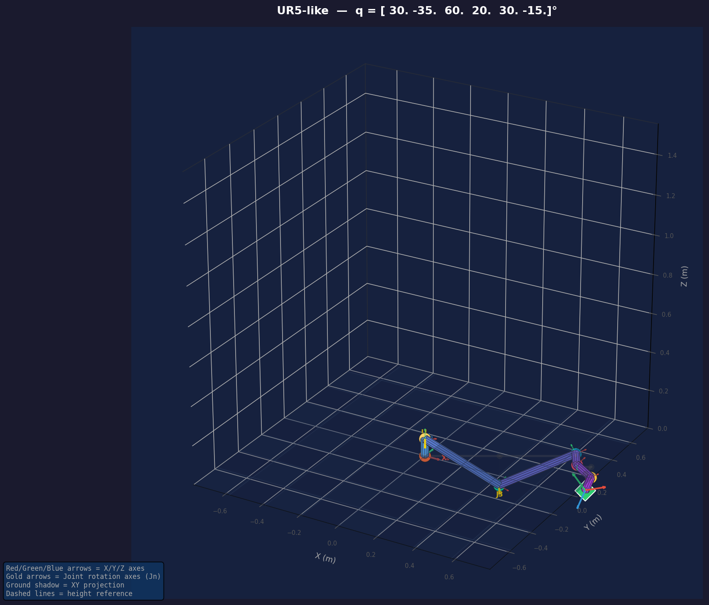
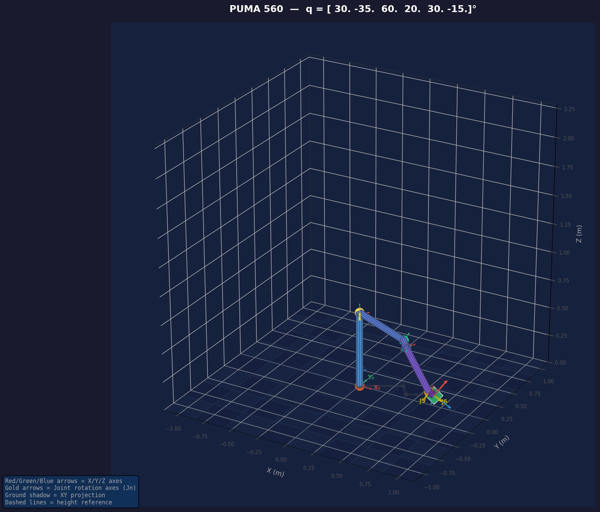
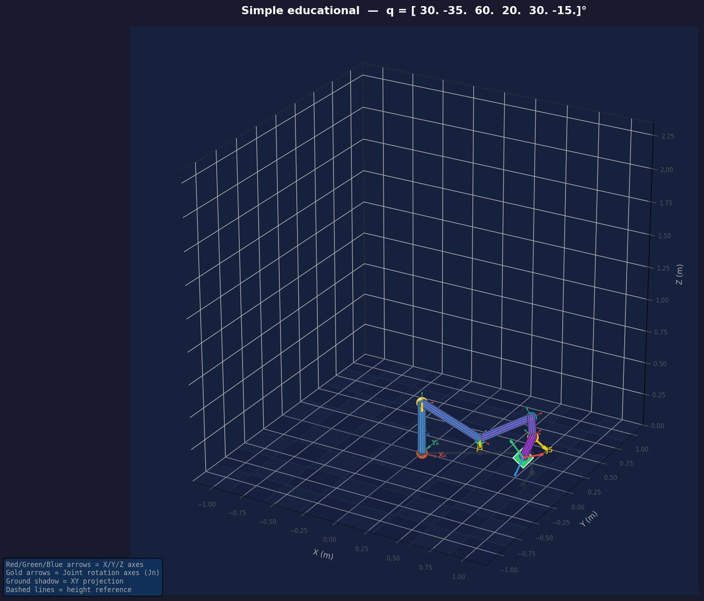
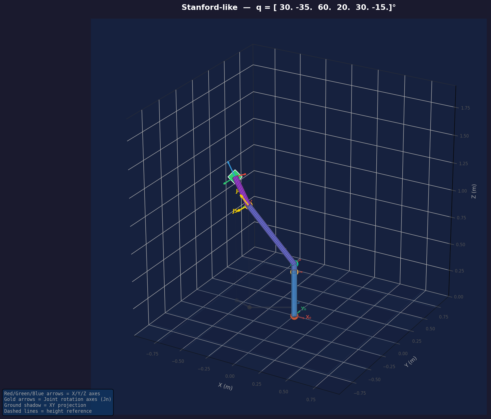

# 🤖 Robot Arm 6-DOF Simulator


A fully modular Python simulator for a 6-DOF revolute serial manipulator, featuring:

- **Forward Kinematics** via Denavit-Hartenberg convention  
- **Inverse Kinematics** — three iterative Jacobian-based solvers  
- **Interactive 3D Visualizer** with per-joint sliders (Matplotlib)  
- **Singularity detection** + manipulability analysis  
- **Trajectory planning** (joint-space cubic spline + Cartesian straight-line)  
- **28 unit tests** with 100% pass rate

> Built as a portfolio project demonstrating computational robotics from first principles using only NumPy and Matplotlib.

---

## 📐 Mathematical Foundation

### 1. Denavit-Hartenberg Convention

Each joint is described by **four scalar parameters** that uniquely define the rigid-body transform between consecutive frames:

| Symbol | Name | Meaning |
|--------|------|---------|
| **θᵢ** | Joint angle | Rotation about Zᵢ₋₁ *(variable — revolute joint)* |
| **dᵢ** | Link offset | Translation along Zᵢ₋₁ |
| **aᵢ** | Link length | Distance between Zᵢ₋₁ and Zᵢ axes |
| **αᵢ** | Twist angle | Angle between Zᵢ₋₁ and Zᵢ |

The **homogeneous transform** for a single joint:

```
ᵢ₋₁Tᵢ = Rot_z(θᵢ) · Trans_z(dᵢ) · Trans_x(aᵢ) · Rot_x(αᵢ)

    ┌ cθ  -sθ·cα   sθ·sα   a·cθ ┐
    │ sθ   cθ·cα  -cθ·sα   a·sθ │
    │  0    sα      cα      d    │
    └  0     0       0      1    ┘
```

**Forward Kinematics** chains all n transforms:

```
T_ee = ⁰T₁ · ¹T₂ · ²T₃ · ³T₄ · ⁴T₅ · ⁵T₆
```

The top-left 3×3 block is the **rotation matrix R**; the right column is the **position p**.

---

### 2. Geometric Jacobian

The Jacobian **J ∈ ℝ⁶ˣⁿ** maps joint velocities to end-effector velocities:

```
ẋ = J(θ) · θ̇
```

For each **revolute** joint i, the Jacobian column is:

```
Jᵢ = [ zᵢ₋₁ × (pₑ − pᵢ₋₁) ]    ← linear velocity
     [        zᵢ₋₁          ]    ← angular velocity
```

where `zᵢ₋₁` is the Z-axis of frame i−1 (rotation axis) and `pₑ − pᵢ₋₁` is the vector to the end-effector.

---

### 3. Inverse Kinematics — Iterative Solvers

All three solvers follow the same loop:

```
while ‖Δx‖ > ε and iter < max_iter:
    Δx = pose_error(T_current, T_target)   # 6D error
    J  = geometric_jacobian(θ)
    Δθ = solve(J, Δx)                      # depends on method
    θ  = θ + Δθ
    θ  = clip(θ, limits)
```

#### Method A — Jacobian Transpose
```
Δθ = α · Jᵀ · Δx
```
Simple and always stable. Converges slowly but never diverges. Best for real-time applications.

#### Method B — Pseudoinverse (Moore-Penrose)
```
J⁺ = Vˑ Σ⁺ˑ Uᵀ    (via SVD,  σᵢ < ε → zeroed)
Δθ = J⁺ · Δx
```
Minimum-norm solution. Fast convergence but numerically unstable near singularities.

#### Method C — Damped Least Squares *(recommended)*
```
J⁺_λ = Jᵀ (JJᵀ + λ²I)⁻¹
Δθ   = J⁺_λ · Δx
```
The damping factor λ prevents singular blow-up. With adaptive damping, λ scales with σ_min.

| Method | Convergence | Singularity robustness | Cost |
|--------|-------------|----------------------|------|
| Transpose | Slow | ✅ High | Low |
| Pseudoinverse | Fast | ❌ Low | Medium |
| DLS | Medium | ✅ High | Medium |

---

### 4. Singularity Detection

A **kinematic singularity** occurs when the arm loses one or more degrees of freedom. Indicators:

- **Manipulability index** (Yoshikawa): `w = √det(J·Jᵀ)` → 0 at singularity
- **Minimum singular value**: `σ_min < ε` → singular
- **Condition number**: `κ = σ_max / σ_min` → ∞ at singularity

Common singularity types for a 6-DOF arm:
- **Shoulder singularity**: wrist centre on shoulder Z-axis
- **Elbow singularity**: arm fully extended or folded
- **Wrist singularity**: axes 4 and 6 are collinear (joint 5 ≈ 0)

---

## 🗂️ Project Structure

```
robot_arm_6dof/
├── robot_arm/
│   ├── __init__.py            # Public API
│   ├── config.py              # DH presets, joint limits, solver params
│   ├── forward_kinematics.py  # DH matrix, FK chain, pose error
│   ├── jacobian.py            # Geometric Jacobian, manipulability
│   ├── inverse_kinematics.py  # JT, pseudoinverse, DLS solvers
│   ├── robot.py               # Robot6DOF main class
│   ├── trajectory.py          # Joint-space & Cartesian trajectory
│   └── visualizer.py          # Matplotlib 3D interactive viewer
├── tests/
│   └── test_kinematics.py     # 28 unit tests (pytest)
├── docs/
│   ├── robot_ur5_like.png     # UR5-like reference render
│   ├── robot_ur5_like_multiview.png
│   ├── robot_puma560.png      # PUMA 560 reference render
│   ├── robot_simple.png       # Simple arm reference render
│   └── robot_stanford.png     # Stanford-like reference render
├── main.py                    # Interactive visualizer launcher
├── demo.py                    # Headless demo (FK, IK, trajectory)
├── generate_reference.py      # Generate reference images for each preset
├── requirements.txt
├── setup.py
└── README.md
```

---

## 🚀 Quick Start

```bash
# 1. Clone and install
git clone https://github.com/jams286/robot_arm_6dof
cd robot-arm-6dof
pip install -r requirements.txt

# 2. Run interactive visualizer
python main.py                      # UR5-like preset
python main.py --preset simple      # Educational arm
python main.py --q 0 -45 90 0 45 0 # Start at specific angles

# 3. Run headless demos
python demo.py --demo fk    # Forward kinematics analysis
python demo.py --demo ik    # IK solver comparison
python demo.py --demo traj  # Trajectory planning
python demo.py --demo all   # All demos

# 4. Generate reference images
python generate_reference.py              # All presets
python generate_reference.py --preset ur5_like  # Single preset

# 5. Run tests
pytest tests/ -v
```

---

## 🐍 Python API

```python
from robot_arm import Robot6DOF
import numpy as np

# Create robot
robot = Robot6DOF(preset='ur5_like')

# Forward kinematics
T = robot.fk([0, -np.pi/4, np.pi/2, 0, np.pi/4, 0])
print(f"EE position: {robot.ee_position()}")

# Inverse kinematics (DLS — recommended)
result = robot.ik(T, method='dls')
print(result)

# Singularity check
report = robot.check_singularity()
print(f"Manipulability: {report['manipulability']:.5f}")
print(f"Singular: {report['singular']}")

# Trajectory
from robot_arm import multi_segment_trajectory
waypoints = [np.zeros(6), np.radians([45, -45, 90, 0, 45, 0])]
traj = multi_segment_trajectory(waypoints, n_steps=50, smooth=True)

# Interactive visualizer
from robot_arm import RobotVisualizer
viz = RobotVisualizer(robot)
viz.set_trajectory(traj)
viz.show()
```

---

## ⚙️ DH Presets

| Preset | Description | Similar to |
|--------|-------------|-----------|
| `ur5_like` | 6-DOF industrial-scale arm | Universal Robots UR5 |
| `simple` | Unit-length educational arm | Generic textbook arm |
| `puma560` | Classic industrial arm with spherical wrist | Unimation PUMA 560 |
| `stanford` | 6-DOF all-revolute approximation | Stanford Arm |

**Custom DH table:**
```python
import numpy as np
from robot_arm import Robot6DOF

custom_dh = np.array([
    # a      alpha     d       theta_offset
    [0.000,  np.pi/2,  0.089,  0.0],
    [0.425,  0.000,    0.000,  0.0],
    [0.392,  0.000,    0.000,  0.0],
    [0.000,  np.pi/2,  0.109,  0.0],
    [0.000, -np.pi/2,  0.094,  0.0],
    [0.000,  0.000,    0.082,  0.0],
])
robot = Robot6DOF(dh_params=custom_dh)
```

---

## 📊 Test Results

```
28 passed

TestDHMatrix          (5 tests)  — identity, shape, det, rotation
TestForwardKinematics (6 tests)  — NaN, shape, orthonormality, reproducibility
TestJacobian          (5 tests)  — shape, FD consistency, manipulability
TestIK               (8 tests)  — convergence, roundtrip, limits, API, unreachable targets
TestRobotClass        (5 tests)  — presets, clipping, random, home
```

---

## �️ Reference Images

Generated with `generate_reference.py`. Each image shows the robot with colour-coded links, joint spheres, coordinate frames (RGB = XYZ), rotation-axis arrows, ground grid, shadow projection, and DH parameter annotations.

| UR5-like | PUMA 560 |
|:---:|:---:|
|  |  |

| Simple | Stanford-like |
|:---:|:---:|
|  |  |

---

## �📚 References

1. Siciliano, B. et al. *Robotics: Modelling, Planning and Control*. Springer, 2010.
2. Buss, S. R. "Introduction to Inverse Kinematics with Jacobian Transpose, Pseudoinverse and Damped Least Squares." *Technical Report*, UCSD, 2004.
3. Yoshikawa, T. "Manipulability of Robotic Mechanisms." *International Journal of Robotics Research*, 4(2), 1985.
4. Craig, J. J. *Introduction to Robotics: Mechanics and Control*. Pearson, 2005.

---

## 📄 License

MIT — free for personal and commercial use. Attribution appreciated.

---

## 🤖 AI Acknowledgment

This project was developed with the assistance of **Claude** (Anthropic). The AI helped with architecture design, code implementation, test creation, and documentation. All logic was reviewed and validated by the author to ensure correctness.

> I believe in transparency about the use of AI tools in software development.
